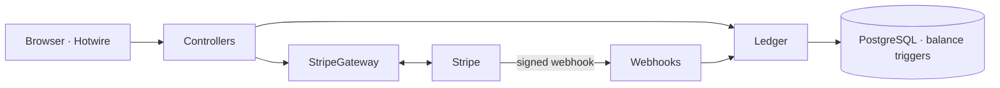
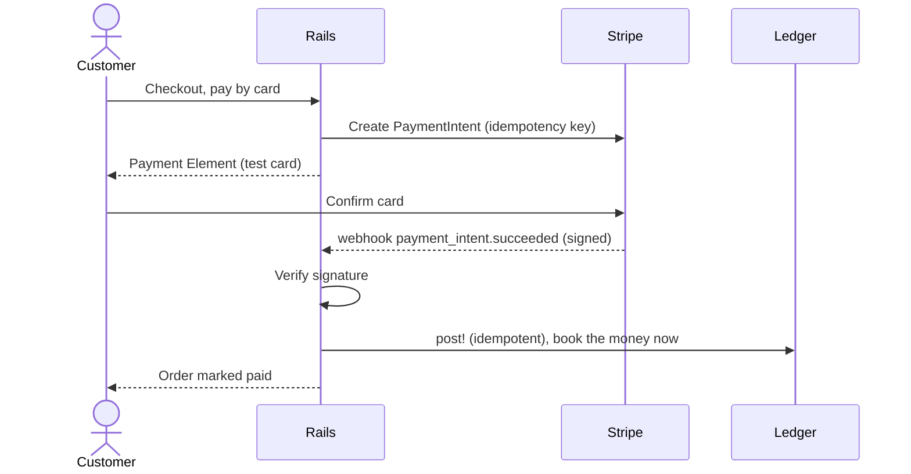

<div align="center">

# Dallah Coffee

A double-entry payments and wallet ledger, built in Rails 8.

[](https://github.com/MohammedAltounsi/rails-stripe-wallet-ledger-sandbox/actions/workflows/ci.yml)


[Live demo](https://dallah-coffee.onrender.com) · [How it works](#how-it-works) · [Run it](#run-it)

</div>

---

A coffee-ordering app with a real money core. Customers top up a wallet, pay by
card or from that wallet, and every halala is tracked in a double-entry ledger
that can be checked against Stripe to the last unit. It runs in Stripe test mode,
so no real card is ever charged. Use `4242 4242 4242 4242`, any future date, any CVC.

## What it does

| Area | What happens | Where |
|---|---|---|
| Double-entry ledger | Every entry's postings sum to zero. Balances are summed from an append-only log, never stored, so they cannot drift. | `app/models/ledger.rb`, `account.rb` |
| Idempotency | A retried request or a redelivered webhook moves money once, enforced by an idempotency key and a unique index. | `Ledger.post!` |
| Stripe payments | Card charges via PaymentIntents and the embedded Payment Element. | `app/models/stripe_gateway.rb` |
| Webhooks | Signature-verified. The wallet is credited and the order marked paid only on `payment_intent.succeeded`. | `app/controllers/webhooks/stripe_controller.rb` |
| Wallet | Top up, then spend. The spend is row-locked, so two concurrent checkouts cannot overdraw it. | `checkout_controller.rb`, `wallet_controller.rb` |
| Reconciliation | Compares the ledger against Stripe and reports dropped webhooks, amount mismatches, and orphan credits. | `app/services/reconciliation_service.rb` |

## How it works



Money moves through one method, `Ledger.post!(memo, lines, key:)`, inside a
transaction. The rules it enforces:

1. Every entry balances. Its lines must sum to zero, or it rolls back.
2. Balances are derived. `Account#balance_cents` sums postings; nothing is stored to fall out of sync.
3. The webhook is the source of truth. Creating a PaymentIntent moves no money; the charge is booked only when Stripe confirms it.
4. Money is integer halalas. No floats anywhere in the money path.
5. Postgres has the final say. A deferred trigger rejects any unbalanced entry or negative wallet balance, even if the app has a bug.

## Paying by card



## Run it

Needs Ruby 4.0+, the [Stripe CLI](https://stripe.com/docs/stripe-cli), and a Stripe test account.

```bash
bundle install
bin/rails db:setup
```

Put your test keys in `.env.local` (gitignored):

```
STRIPE_PUBLISHABLE_KEY=pk_test_...
STRIPE_SECRET_KEY=sk_test_...
STRIPE_WEBHOOK_SECRET=whsec_...
```

Run the app and the webhook tunnel in two shells:

```bash
bin/rails server
stripe listen --forward-to localhost:3000/webhooks/stripe
```

Open <http://localhost:3000>. See the ledger at `/ledger` and reconciliation at `/reconciliation`.

## Tests

```bash
bin/rails test
```

Covers the ledger invariants, idempotent crediting, webhook signature checks, and
the locked wallet spend (no overdraft, no double-spend). Brakeman and bundler-audit
run on every push.

## Security

- Webhooks are signature-verified before any money moves.
- Content Security Policy with per-request script nonces, `force_ssl` with HSTS, and a host allowlist.
- rack-attack throttles the write endpoints.
- All secrets come from environment variables; the credentials key is never committed.
- Brakeman and bundler-audit gate every push in CI.

## Demo notes

This is a portfolio demo, and two things are open on purpose:

- Anyone can switch between the seeded customers with no login. Orders and receipts are scoped to the browser session, so one visitor never sees another's.
- `/ledger` and `/reconciliation` are public, because they are the exhibit. They show synthetic data only.

Both are safe under two rules: Stripe stays in test mode, and the seed data stays fictional.

## Author

**Mohammed Altounsi**

I build payment systems, e-commerce stores, and the web apps and marketing that
run around them. This repo is one working example: a payments and wallet ledger
designed to stay correct under retries, race conditions, and webhook redelivery,
and hardened to run in production.

- LinkedIn: <https://www.linkedin.com/in/mohammed-altounsi/>
- GitHub: [@MohammedAltounsi](https://github.com/MohammedAltounsi)
- Email: mhmdaltounsi@gmail.com

## License

MIT. See [LICENSE](LICENSE).
