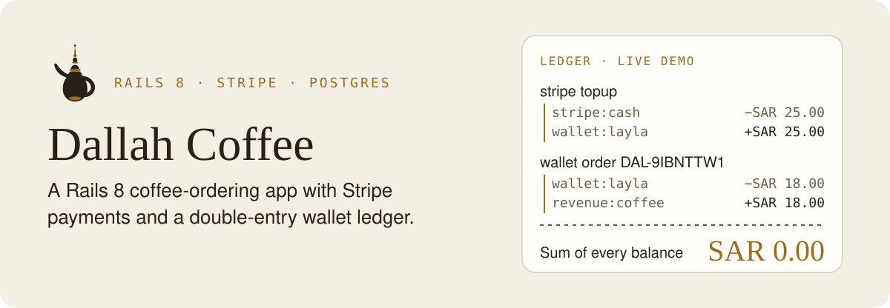
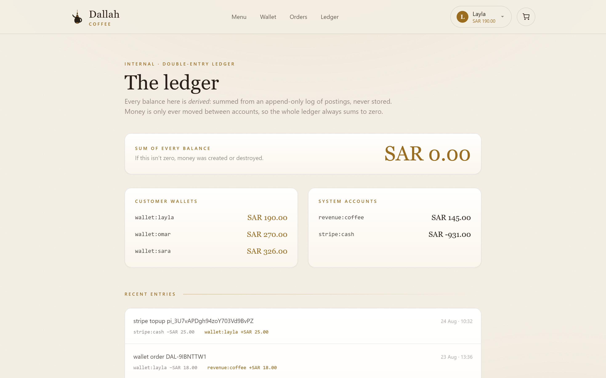
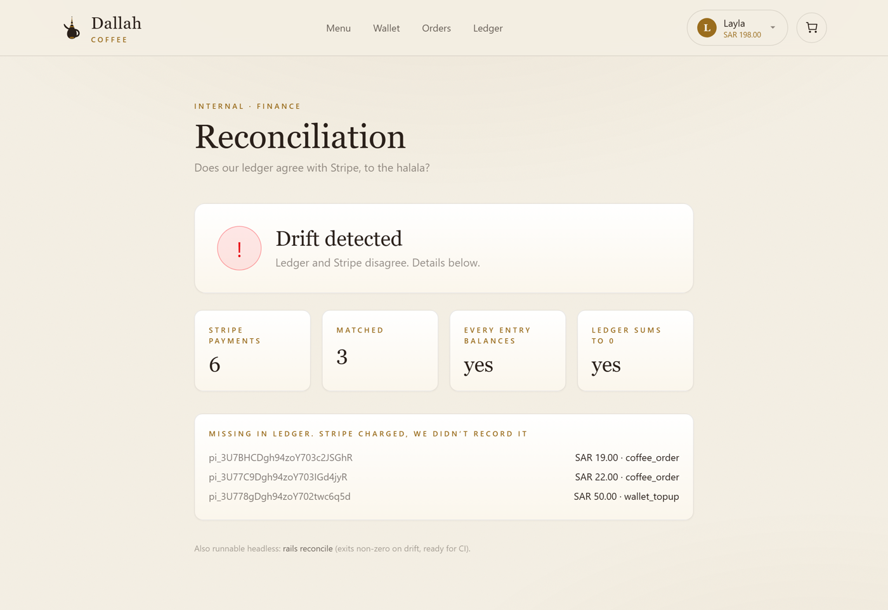
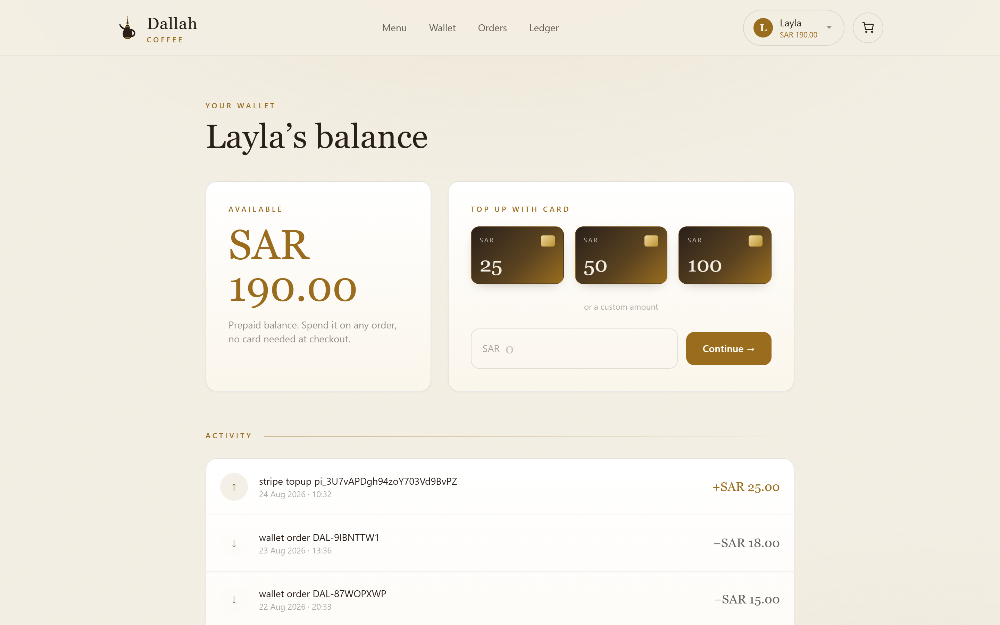
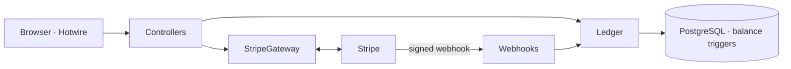
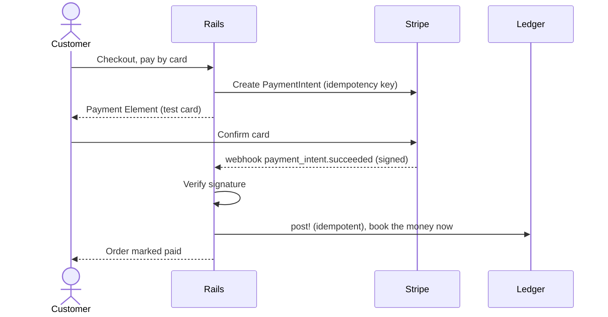

<div align="center">

<picture>
  <source media="(prefers-color-scheme: dark)" srcset="assets/readme/hero-dark.svg">
  
</picture>

<br>

[](https://github.com/MohammedAltounsi/rails-stripe-wallet-ledger-sandbox/actions/workflows/ci.yml)    

### [Open the live demo](https://dallah-coffee.onrender.com) · [See the ledger](https://dallah-coffee.onrender.com/ledger) · [See reconciliation](https://dallah-coffee.onrender.com/reconciliation)

The demo uses Stripe test mode, so no real card is charged. Pay with `4242 4242 4242 4242`, any future date, any CVC.<br>
It runs on Render's free tier, so the first load can take up to a minute.

<br>


</div>

A Rails 8 coffee-ordering app with Stripe payments. Customers can top up a
wallet and pay by card or from the wallet. Every payment is recorded in a
double-entry ledger in PostgreSQL, and a reconciliation page compares the
ledger with Stripe.

## What it does

- **Double-entry ledger.** The postings in each entry sum to zero. Balances are computed from an append-only log instead of a stored column, so they can't get out of sync. (`app/models/ledger.rb`, `account.rb`)
- **Idempotency.** A retried request or a redelivered webhook moves money once. An idempotency key with a unique index enforces this. (`Ledger.post!`)
- **Stripe payments.** Card charges via PaymentIntents and the embedded Payment Element. (`app/models/stripe_gateway.rb`)
- **Webhooks.** Each webhook's signature is verified. The app credits the wallet or marks the order paid when `payment_intent.succeeded` arrives. (`app/controllers/webhooks/stripe_controller.rb`)
- **Wallet.** Customers top up, then spend. A wallet spend locks the wallet row, so two checkouts at the same time can't overdraw it. (`checkout_controller.rb`, `wallet_controller.rb`)
- **Reconciliation.** Compares the ledger against Stripe and reports dropped webhooks, amount mismatches, and orphan credits. (`app/services/reconciliation_service.rb`)

## Screenshots

The ledger and reconciliation pages are public in the demo so you can look at
them. They show made-up data only.

<table>
<tr>
<td width="50%">

<p align="center"><b>Ledger</b><br>Account balances computed from the postings, and the global sum, which is 0.</p>
</td>
<td width="50%">

<p align="center"><b>Reconciliation</b><br>Compares the ledger with Stripe. <code>bin/rails reconcile</code> runs the same check from the command line and exits non-zero on drift.</p>
</td>
</tr>
<tr>
<td width="50%">

<p align="center"><b>Wallet</b><br>A prepaid balance. Top-ups are credited when the verified webhook arrives, and each top-up and spend is a ledger posting.</p>
</td>
<td width="50%" valign="middle">
<p align="center">Orders can be paid by card or from the wallet.<br>Both are recorded in the same ledger.</p>
</td>
</tr>
</table>

## How it works


```mermaid
flowchart LR
    B[Browser · Hotwire] --> C[Controllers]
    C --> L[Ledger]
    C --> G[StripeGateway]
    G <--> S[Stripe]
    S -->|signed webhook| W[Webhooks]
    W --> L
    L --> DB[(PostgreSQL · balance triggers)]
```

All money moves through one method, `Ledger.post!(memo, lines, key:)`, which
runs inside a transaction. It enforces these rules:

1. An entry's lines must sum to zero. If they don't, the transaction rolls back.
2. Balances are computed. `Account#balance_cents` sums the postings, and no balance is stored.
3. Charges are booked from the webhook. Creating a PaymentIntent doesn't move money. The charge is booked when Stripe confirms it.
4. Amounts are integer halalas. The money code doesn't use floats.
5. Postgres checks again. A deferred trigger rejects an unbalanced entry or a negative wallet balance, even if app code skipped the check.

For the reasoning behind each decision and what would change at scale, see [ARCHITECTURE.md](ARCHITECTURE.md).
For what to do when reconciliation reports drift, see [RUNBOOK.md](RUNBOOK.md).

<details>
<summary><b>Paying by card, step by step</b></summary>


```mermaid
sequenceDiagram
    actor Cust as Customer
    participant App as Rails
    participant Stripe
    participant Ledger
    Cust->>App: Checkout, pay by card
    App->>Stripe: Create PaymentIntent (idempotency key)
    App-->>Cust: Payment Element (test card)
    Cust->>Stripe: Confirm card
    Stripe-->>App: webhook payment_intent.succeeded (signed)
    App->>App: Verify signature
    App->>Ledger: post! (idempotent), book the money now
    App-->>Cust: Order marked paid
```

</details>

## Run it

Needs Ruby 4.0+, the [Stripe CLI](https://stripe.com/docs/stripe-cli), and a Stripe test account.

```bash
bundle install
bin/rails db:setup
```

Put your test keys in `.env.local` (gitignored):

```
STRIPE_PUBLISHABLE_KEY=pk_test_...
STRIPE_SECRET_KEY=sk_test_...
STRIPE_WEBHOOK_SECRET=whsec_...
```

Run the app and the webhook tunnel in two shells:

```bash
bin/rails server
stripe listen --forward-to localhost:3000/webhooks/stripe
```

Open <http://localhost:3000>. See the ledger at `/ledger` and reconciliation at `/reconciliation`.
Deployment notes are in [docs/DEPLOY.md](docs/DEPLOY.md).

## Tests

```bash
bin/rails test
```

The tests cover the ledger invariants, idempotent crediting, webhook signature
checks, and the locked wallet spend (no overdraft and no double-spend). CI also
runs Brakeman and bundler-audit on every push.

<details>
<summary><b>Security</b></summary>

- Webhooks are signature-verified before any money moves.
- Content Security Policy with per-request script nonces, `force_ssl` with HSTS, and a host allowlist.
- rack-attack throttles the write endpoints.
- Secrets come from environment variables. The credentials key is not in the repo.
- CI fails a push if Brakeman or bundler-audit finds a problem.

</details>

<details>
<summary><b>Demo notes: what is public in the demo</b></summary>

- Anyone can switch between the seeded customers without logging in. Orders and receipts are tied to the browser session, so visitors can't see each other's orders.
- `/ledger` and `/reconciliation` are public. They show made-up data only.

This is only safe because Stripe runs in test mode and the seed data is fictional.

</details>

## Author

**Mohammed Altounsi**

I build payment systems and e-commerce stores, plus the web apps and
marketing around them. This repo is an example of my payments work. It handles
retries, concurrent requests and redelivered webhooks without moving money
twice.

- LinkedIn: <https://www.linkedin.com/in/mohammed-altounsi/>
- GitHub: [@MohammedAltounsi](https://github.com/MohammedAltounsi)
- Email: mhmdaltounsi@gmail.com

## License

MIT. See [LICENSE](LICENSE).
